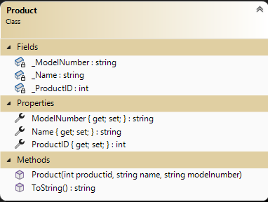

# In Class Assessment 01 - Classes and Unit Tests (Course Weight 15%)

## Multiple Choice (Weight 4%) /  Coding Problem (Weight 11%)

## Coding Problem

## Overview

Your task is to generate a  developer defined data type to represent the primary objects for managing a product registration list. The evaluation rubric is indicated at the bottom of these specifications.

A [.NET Solution file](src/AssessmentSolution.sln) with a class library project and an xUnit test project has already been provided to you and can be found in the **`src`** folder. Use this solution when providing your answers for this assessment. Do **not** create your own solutions or projects for this assessment. Your work **must** be submitted within **this** repository and pushed to github.com.

In this assessment, you are required to demonstrate your ability to:

- Code C# classes complete with properties, fields, constructors, and/or methods
- Ensure proper functionality of your classes/objects by use of exceptions for invalid inputs
- Prove the validity of your solution through unit tests

### Use Frequent Commits

Commit your work at the end of each and every **Activity**. ***Mark(s) may be deducted based on the commit activity in your repository.*** Ensure you sync your local clone to GitHub before the end of class. The classroom assessment ends at the end of class period. **It is your responsibility to ensure your work is properly submitted. Failure to submit your work may result in deductions up to and including a final mark of 0 (zero) for this assessment.**

### General Validation Rules

Your classes must throw exceptions for all invalid inputs. Do **not** attempt to perform any console input/output in your code. Here are some general validation requirements.

- Exceptions must have meaningful error messages.
- Use the following exception types for validation.
  - Missing value for parameter: `ArgumentNullException`
  - Invalid values not in the proper domain (example non postive limit or format): `ArgumentException`
- All string information must contain text. Null, empty, and plain white-space text is not allowed. Sanitize your strings by trimming the leading and trailing whitespace if a string exists.

### Unit Testing

Create your unit tests within the appropriate file supplied for you in the **xUnit Testing** project. Use FluentAssertions for your unit tests. Create meaningful names for your unit test methods. Do not create an exhaustive test suite; ***only the requested unit tests need to be coded.***

----

## Activity1: Product class

The `Product.cs` file has been created for you in the class library project. Complete the **`Product`** class definition by providing all its members according to the [class diagram](#class-diagram).

- The `Product` class' properties are to be **auto-implemented** properties:
  - a `integer` called **`ProductID`**
  - a `string` called **`Name`** cannot be blank and must be trimmed
  - a `string`  called **`ModelNumber`** cannot be blank and must be trimmed
- Initialize these data properties using a greedy constructor.
- Validate that the Name and ModelNumber have data. Do this validation in the greedy constructor.
- Override the `ToString()` method to return the product's data, as a comma delimited string (no excess spaces).

### `Product_Should` class

Prove the validity of your `Product` class by writing tests for the following:

- Test that the `ProductID`, `Name` and `ModelNumber` data has been properly stored via the greedy constructor.
- Test that `ModelNumber` missing data results in an `ArgumentNullException`.

----

## Activity 2: Alter Product class

Alter the `Product.cs` class. Move all validation into their respective properties. The properties will need to be altered from auto-implemented to fully-implemented properties.

- `ProductID` must be greater than 0
- `Name` cannot be blank and must be trimmed
- `ModelNumber` cannot be blank, must have a pattern of xx-x-999-x and must be trimmed. Note: **x** represents a character (A-Z) and **9** represents a numerical digit (0-9).
- Refactor your code from Activity 1.

### Alter `Product_Should` class

Add the following validity of your `Product` class by writing tests for the following:

- Test that `ProductID` has a value greater than 0 when the property is changed. Create two tests, one for success, one on failure.  
- Test that invalid data format for `ModelNumber` throws an `ArgumentException` where the message includes the invalid data.

----

### Class Diagram

> **Remember:** When you are finished **each** activity that you commit the work. Make sure you have pushed your final code to GitHub.
>

|  Weight   |      Deliverable       |
| :------:  | :--------------------: |
|    3     |   Activity 1 Product class   |
|    3     | Activity 1  Unit Tests |
|    3     |    Activity 2 Product class  |
|    3     |  Activity 2 Unit Tests |
|   ----   |       ----------      |
|    12    |         Total         |

## Marking Rubric

| Weight | Breakdown  |
| ------ | ---------- |
| **1**  | 1 = Proficient (requirement is met) 0 = Incomplete (requirement not met, missing large portions, does not meet class standards) |
| **2**  | 2 = Proficient (requirement is met) 1 = Limited (requirement is poorly met, minor errors, does not meet class standards) 0 = Incomplete (requirement not met, missing large portions, does not meet class standards) |
| **3**  | 3 = Proficient (requirement is met) 2 = Capable (requirement is adequately met, minor errors, does not meet class standards) 1 = Limited (requirement is poorly met, major errors, does not meet class standards) 0 = Incomplete (requirement not met, missing large portions, does not meet class standards) |
| **4**  | 4 = Proficient (requirement is met) 3 = Capable (requirement is adequately met, minor errors, does not meet class standards) 2 = Acceptable (requirement is partially met, minor errors, does not meet class standards) 1 = Limited (requirement is poorly met, major errors, does not meet class standards) 0 = Incomplete (requirement not met, missing large portions, does not meet class standards) |
| **5**  | 5 = Proficient (requirement is met) 4 = Capable (requirement is adequately met, minor errors, does not meet class standards) 3 = Acceptable (requirement is partially met, minor errors, does not meet class standards) 2 = Sub-Par (requirement is partially met, major errors, does not meet class standards) 1 = Limited (requirement is poorly met, major errors, does not meet class standards) 0 = Incomplete (requirement not met, missing large portions, does not meet class standards) |

